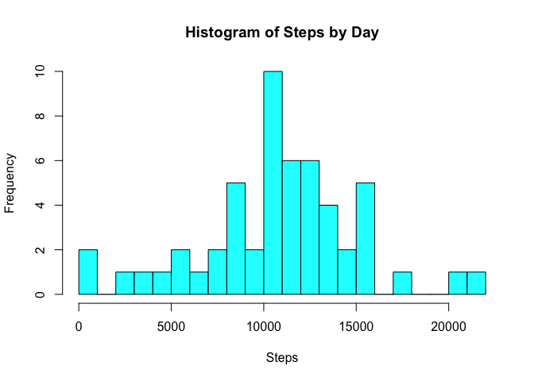
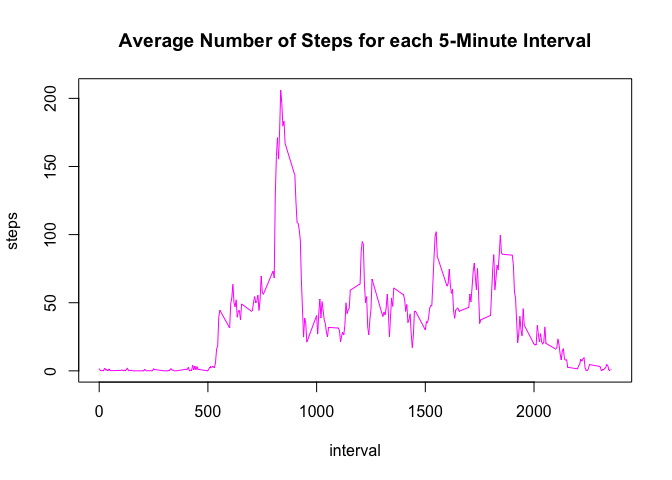
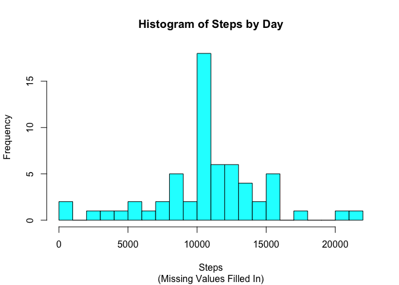
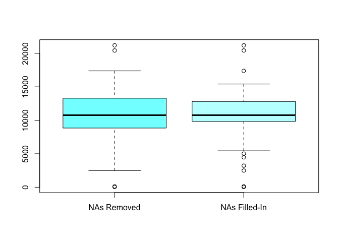
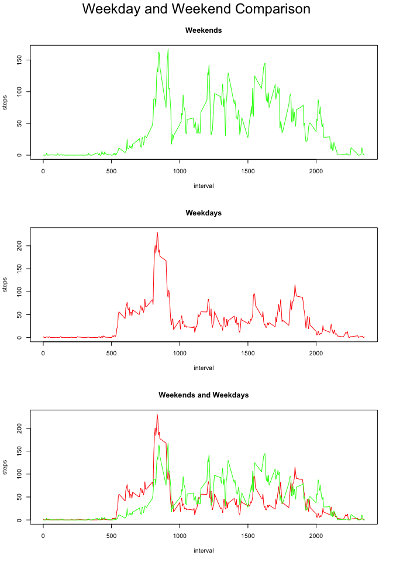

# Reproducible Research: Peer Assessment 1

## Setting environment

First of all, the 'dplyr' package must be loaded in order to reproduce this analysis.


```r
library(dplyr)
```

If 'dplyr' is not installed, it can be easily obtained by typing:


```r
install.packages("dplyr")
```

## Loading and preprocessing the data


```r
# We want to check first if the data has been unzipped
if (!file.exists("activity.csv"))
    unzip("activity.zip")

# Read the data. Note that it's better to read the
# date field as a Date class
data <- read.csv("activity.csv",colClasses=c("integer","Date","integer"))

# Make the data object compatible with the 'dplyr' library
data <- tbl_df(data)
```

For now let's get rid of the missing values.


```r
data.no.NAs <- data[!is.na(data$steps),]
```

## What is mean total number of steps taken per day?

The first step is to use the 'dplyr' package to sum all the steps grouping them by day.

```r
by.day <- 
    data.no.NAs %>%
    group_by(date) %>%
    summarize(steps=sum(steps))
```

With this new data set, we plot the histogram.


```r
hist(by.day$steps,
     breaks=20,
     col="cyan",
     main="Histogram of Steps by Day",
     xlab="Steps")
```

 

Calculate the mean.

```r
mean(by.day$steps)
```

```
## [1] 10766.19
```

Calculate the median.

```r
median(by.day$steps)
```

```
## [1] 10765
```

## What is the average daily activity pattern?

As in the previous section, the first step is to pre-process the data and group the average number of steps by time interval using the 'dplyr' package.


```r
by.interval <- 
    data.no.NAs %>% 
    group_by(interval) %>% 
    summarize(steps=mean(steps))
```

We can view the results using a plot.


```r
plot(by.interval,
     type='l',
     col="magenta",
     main="Average Number of Steps for each 5-Minute Interval")
```

 

Now let's find out which interval contains the highest value.


```r
which.max(by.interval$steps)
```

```
## [1] 104
```

On average, interval # 104 contains the highest value, which is 206.17.

## Imputing missing values

In order to impute missing values, it may me useful to get a summary to learn more about each column and their missing values.


```r
summary(data)
```

```
##      steps             date               interval     
##  Min.   :  0.00   Min.   :2012-10-01   Min.   :   0.0  
##  1st Qu.:  0.00   1st Qu.:2012-10-16   1st Qu.: 588.8  
##  Median :  0.00   Median :2012-10-31   Median :1177.5  
##  Mean   : 37.38   Mean   :2012-10-31   Mean   :1177.5  
##  3rd Qu.: 12.00   3rd Qu.:2012-11-15   3rd Qu.:1766.2  
##  Max.   :806.00   Max.   :2012-11-30   Max.   :2355.0  
##  NA's   :2304
```

There are 2304 missing values in the 'steps' field.

Before we decide a strategy to impute the missing values let's perform some additional data exploration.
Using 'dplyr' we can see which specific days have missing values and how many.


```r
data %>% 
    group_by(date) %>% 
    summarize(NAs=sum(is.na(steps)), total=n()) %>% 
    filter(NAs>0)
```

```
## Source: local data frame [8 x 3]
## 
##         date NAs total
## 1 2012-10-01 288   288
## 2 2012-10-08 288   288
## 3 2012-11-01 288   288
## 4 2012-11-04 288   288
## 5 2012-11-09 288   288
## 6 2012-11-10 288   288
## 7 2012-11-14 288   288
## 8 2012-11-30 288   288
```

From this results we can tell that is not feasible to impute the missing values by averaging by day because there are entire days with not a single value. Fortunately all the other days have complete values.

Thus the strategy to impute the missing values is to average across all intervals and assign this value to the missing values only.


```r
data.completed <- 
    data %>% 
    # we group by interval
    group_by(interval) %>% 
    # we create another value to hold the average and we assign it 
    # to 'steps' only if it had a NA value
    mutate(avg=mean(steps,na.rm=T), steps=ifelse(is.na(steps),avg,steps)) %>% 
    # we get rid of the temporary variable
    select(-avg)
```

To compare our data, let's group by date.


```r
by.day.completed <- 
    data.completed %>%
    group_by(date) %>%
    summarize(steps=sum(steps))
```

With this new data set, we plot the histogram.


```r
hist(by.day.completed$steps,
     breaks=20,
     main="Histogram of Steps by Day",
     sub="(Missing Values Filled In)",
     col="cyan",
     xlab="Steps")
```

 

Calculate the mean now that we have filled in the missing values.

```r
mean(by.day.completed$steps)
```

```
## [1] 10766.19
```

Do the same for the median.

```r
median(by.day.completed$steps)
```

```
## [1] 10766.19
```

The histogram for the completed dataset looks quite similar to the previous histogram.

The mean difference is 0.0000 and the median difference is 1.1887.

We can also make box plots to compare the distribution of both scenarios.

* NAs Removed. 
* NAs Filled-In 
 

```r
# Let's joind both data sets adding a factor variable
data.joined <- rbind(
    cbind(by.day,status=as.factor("NAs Removed")),
    cbind(by.day.completed,status=as.factor("NAs Filled-In"))
    )

boxplot(steps~status,data.joined,col=cm.colors(4))
```

 

From this analysis we can conclude that the overall data is similar. The distribution was affected proportionally so we will get similar results in further anaylses.

## Are there differences in activity patterns between weekdays and weekends?

In order to process this query, we need to add a new factor variable to our completed dataset.


```r
data.completed <- 
    data.completed %>% 
    mutate(
        # determine which day is it
        day=weekdays(date), 
        # add the factor variable
        daytype=as.factor(ifelse(day=="Saturday" | day=="Sunday","weekend","weekday"))
        ) %>% 
    # remore the temporary variable
    select(-day)
```

Now that we can easily separate between weekdays and weekends, let's group by interval for both cases.


```r
by.weekend.completed <- 
    data.completed %>% 
    filter(daytype=="weekend") %>% 
    group_by(interval) %>% 
    summarize(steps=mean(steps))

by.weekday.completed <- 
    data.completed %>% 
    filter(daytype=="weekday") %>% 
    group_by(interval) %>% 
    summarize(steps=mean(steps))
```

And finally, create plots to display results.


```r
par(mfrow=c(3,1),oma = c(0, 0, 2, 0))
plot(by.weekend.completed,type="l",main="Weekends",col="green")
plot(by.weekday.completed,type="l",main="Weekdays",col="red")
plot(by.weekday.completed,type="l",main="Weekends and Weekdays",col="red")
lines(by.weekend.completed,col="green")
mtext("Weekday and Weekend Comparison", outer = TRUE, cex = 1.5)
```

 
